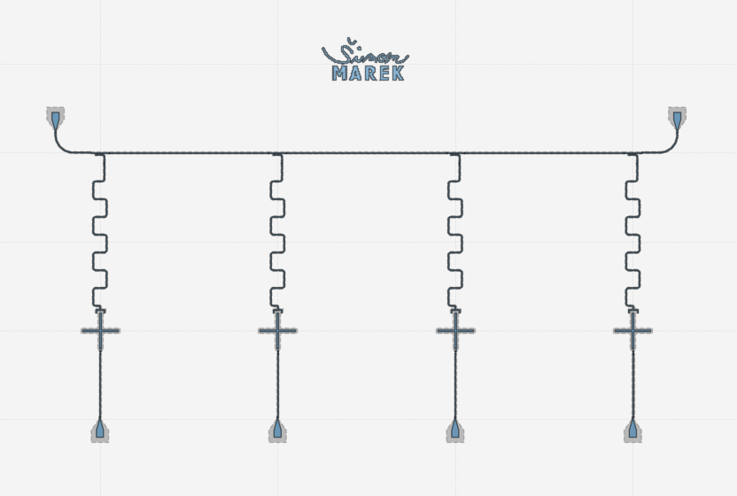
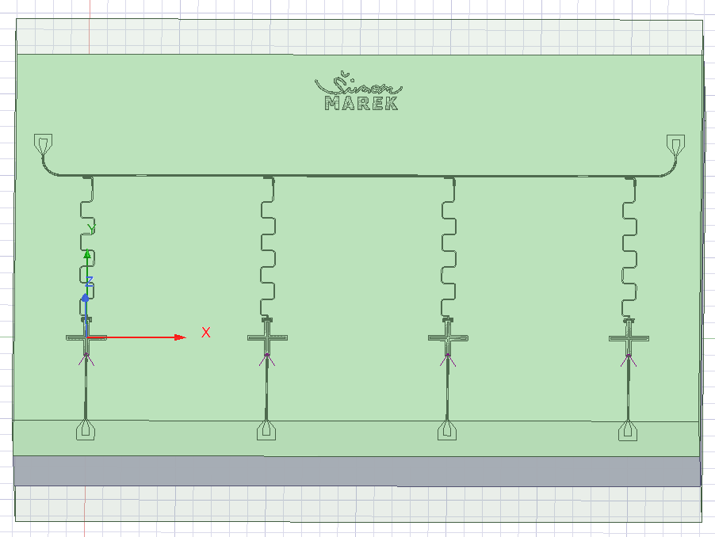

# Qiskit Metal - 4Qubits Cross Transmon

## Tools

- Jupyter Notebook
- Qiskit Metal

## Features

- Qiskit Metal Layout

## Demonstration

#### Qiskit Metal Layout

#### Ansys Render

## Appendix

I picked up most important simulations from Qiskit you should do before you start your quantum chip design. 
By changing major parameters you will influence behaviour of your qubit. 
It is based on this article [Article](https://arxiv.org/pdf/cond-mat/0703002.pdf).
I will attach this file to every quantum chip project.

## Documentation

[QMetal](https://qiskit.org/documentation/metal/)

